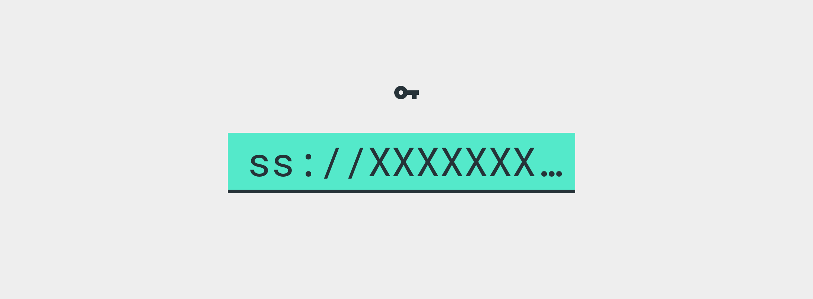

# Инструкции по приглашению

Есть приглашение подключиться к серверу Outline? Следуйте этим инструкциям, чтобы получить доступ к открытому Интернету с вашего устройства. Никакая личная информация не будет собираться.

## 1. Скопируйте ключ доступа

`ss://xxx` находится в нижней части электронного письма или сообщения с приглашением. Приложение Outline мгновенно добавит этот сервер из буфера обмена.

## 2. Установка Outline

|Скачать|  |
| ------------- | ------------- |
| [Android ›](https://play.google.com/store/apps/details?id=org.outline.android.client) | Если Google Play недоступен, [получи это здесь](https://github.com/Jigsaw-Code/outline-releases/blob/master/client/Outline.apk?raw=true). |
| [iOS ›](https://itunes.apple.com/app/outline-app/id1356177741) | Получить Outline в App Store |
| [Windows ›](https://s3.amazonaws.com/outline-releases/client/Outline-Client.exe) | Загрузите Outline.exe и дважды щелкните для запуска. |
| [macOS ›](https://itunes.apple.com/app/outline-app/id1356178125) | Загрузите outline.dmg, дважды щелкните для установки. Добавьте Outline в папку приложений, дважды щелкните для запуска. |
| [Linux ›]( https://s3.amazonaws.com/outline-releases/client/Outline-Client.AppImage) | Скачать Outline.AppImage, [сделать его исполняемым](https://docs.appimage.org/introduction/quickstart.html), затем дважды щелкните, чтобы запустить. |

## 3. Добавить сервер и подключиться

Откройте приложение и подтвердите свой новый сервер. Коснитесь или щелкните, чтобы подключиться.
**Возникли проблемы?** Попробуйте еще раз скопировать ключ доступа, чтобы добавить свой сервер.
